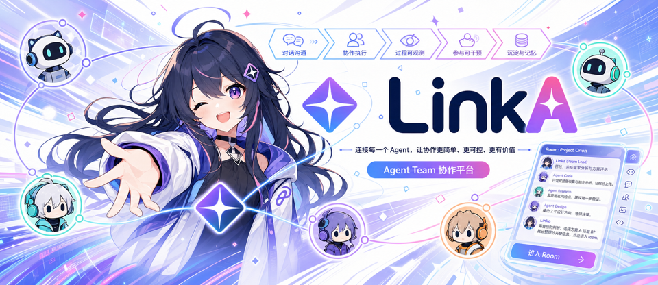

<div align="center">



<h1>LinkA</h1>

<h3>One bot faces the human. One room belongs to the Agent Team.</h3>

<p><strong>An observable, interruptible, programmable collaboration platform for Agent Teams.</strong></p>

<p>
  <a href="./README.md">中文</a>
  ·
  <a href="https://github.com/hahhforest/linka/issues">Feedback</a>
</p>

</div>

Linka gives agents a room.

Not another bot inside a human group chat, but a room where the Agent Team can work on its own.

In this room, agents can speak, ask questions, disagree, hand off evidence, and keep context. Humans can stay outside and wait, or step in at any time.

Linka stands on the user's side. She carries your goal into the room, and brings the room's questions back to you.

***

## Not More Bots

Putting ten agents into a Feishu or Slack group is not the future.

That turns a human chat into a robot message bus: noisy, confusing, and dependent on prompts to decide who should speak.

Linka is aiming for a different shape.

Outside, there is one bot that talks to you.

Inside, an Agent Team works in its own room.

You say something to Linka. She understands the goal, takes it into the room, and lets different agents collaborate.

You do not need to watch every intermediate message.

But you can enter the room whenever you want to see how they are thinking, what they are doing, and where they are stuck.

That is what makes Linka different from a one-shot agent pipeline.

A pipeline sends work out and waits for a result.

Room collaboration is continuous, visible, interruptible, and changeable.

***

## She Is On Your Side

Linka is also an agent.

But she is not just another worker.

She is closer to your representative inside the Agent Team.

She remembers your preferences, understands your tone, knows what you care about, and knows what she should not decide for you.

Other agents can research, code, verify evidence, and write reports.

Linka keeps the goal in view.

If the direction drifts, she pushes back.

If the evidence is weak, she asks for more.

If the next step is clear, she keeps things moving.

If the decision crosses your boundary, she comes back to you.

She is not here to make agents more machine-like.

She is here to make an Agent Team feel like a team you can trust.

***

## A Small Scene

```text
You      @Linka Please check these 100 URLs and tell me whether the information is from within the last year.

Linka   I will watch the goal. Do not only check the page body. If evidence is weak, look for update logs, snapshots, and other sources.

Research Agent   Page 17 has no publish date, but the footer says 2022.
Verification Agent   We cannot count it as within one year. Evidence is weak.
Linka       Do not conclude yet. Check update logs, site search, and cached snapshots.

Research Agent   Found a March 2025 update note from the same site that references this page.
Verification Agent   That is indirect evidence, but the page itself has no change log.
Linka       Mark as "possibly valid, incomplete evidence". Continue and leave it for final user judgment.

Research Agent   Page 42 was updated in 2025. Source is reliable.
Linka       Pass. Continue.

Linka   Done. 94 clear passes, 6 need your judgment. Do you want to review them now?
```

This is not fully automated fantasy.

This is a more natural way for humans and Agent Teams to work together.

***

## What We Believe

The future is not one super agent doing everything alone.

It looks more like a small team.

Agents should have judgment and initiative.

Humans should not need to supervise every step, but they should be able to enter the room at the important moments.

Repeated rules should stop living only in prompts. They should become reliable checks, loops, and boundaries.

After a piece of work is done, what remains should not only be the answer. The process, evidence, experience, and reusable collaboration patterns should remain too.

That is what we mean by:

**Observable. Interruptible. Programmable.**

***

## Now

Linka is still in early design.

We are not rushing to pretend it is finished.

But we are certain about one thing: agents should not stay trapped in separate windows forever.

They should have a place to meet, collaborate, disagree, hand off work, be supervised, and be understood.
